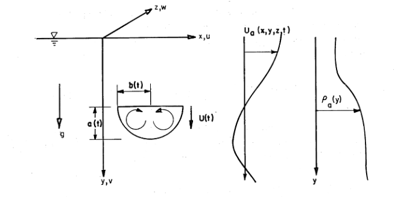

# General Notes 

The purpose of this document is to hold general notes about the model and how it works

I'm confused on how the system evolves. Well either way I'm going to need initial conditions so let's focus on that

# Variable definitions from pdf
NMAX - Maximum dimension of long-term passive diffusion array in z-direction
MMAX - Maximum dimension of long-term passive diffusion array in x-direction
NS   - Number of solid components in discharge (not greater than 12)
NVL  - Number of velocity levels in discharge (not greater than 1 or 2)
NSC  - Maximum number of small clouds allowed per component for transition from short term to long term (value of 20 suggested)

KEY1 - (1) Use default coefficients suggested by Tetra Tech (2) Use coefficients suggested by user
KEY2 - 
    (1) Computation stops at end of convective descent phase 
    (2) Computation stops at end of dynamic collapse
    (3) Computation stops at end  of long-term diffusion

KEY3 - 
    (1) long term diffusion for fluid component
    (2) no long term diffusion for fluid component
KEY4 - 
    (1) No action
    (2) Subsitute user specified time steps, DT, for descent and collapse. used in event of repeated runs
IGCN - 
    (0) - No graphs of convective descent
    (1) - One line pritner graph of convective descent
    (2) - extra graphs of concentrations for convective phase
IGCL - 
    (0) No grpahs of dynamic collapse
    (1) one line printer graph
IPCN - 
    (0) No printed record of convective descent phase
    (1) on eline printer graph
IPCL - 
    (0) No printed record of dynamic collapse phase
    (1) Printed output included
IPLT - 
    (0) Print Long term results at default times (1/4, 2/4, 3/4, 4/4 of TSTOP)
    (n) Nuber of values to be read in of times to print long-term results (up to 12)

ID - Free form alphanumeric description of run
DX - Space step (in feet) for long term grid
DEPTH(N,M) Depths (in feet) read row y row left to right, top to bottom
XBarge - X-coordinate of discharging vessel in estuary
ZBarge - Z-coordinate of dischargine vessel in estuary
NROA - Numbr of points (in depth) where ambient density is specified
Y(I) - Depths (in feet) where density is specified. (The final depth value should be equal the deepest depth in the estuary)

ROA(I) - Density of (gm/cc) of ambient water
IFORM - Type of ambient velocity formation
ROAA - eqv. ROA(1) - Ambient density at the surface - units of gm/cc (grams/cubic centimeter?)
DU1 - Depth (feet) to upper U velocity (x-direction)
DU2 - Depth (feet) to lower U velocity
UU1 - Upper U velocity
UU2 - Lower U Velocity
DW1 - Depth (feet) to lower W velocity
DW2 - Depth (feet) to lower W velocity
WW1 - Upper W velocity (ft/sec)
WW2 - Lower W velocity (ft/sec)

TDUMP - Time of dump to nearest DTL seconds after start of tidal cycle
TSTOP - Duration of nearest DTL seconds of simulation after dump (seconds)
DTL   - Long term time step (seconds) time varying velocities are specified at this interval

DT1U - User-specified time step for convective descent phse (used for repeated runs)
DT2U - User specified time step for dynamic collapse (used for repeated runs)

TPRT(I) - Values of time to print long-term results (integer multiples of DTL in seconds) Number of values equals IPLT?

RB - Radius of initial hemispherical waste cloud (feet)
DREL - Depth of centroid of initial cloud at release (feet)
CU(1) Initial velocity components in x, y, and z directions

ROO   - Bulk density of initial cloud
BVOID - Voids ratio of aggregate solids

PARAM(K) - Alphameric description of solid
ROAS(K)  - Solid density (gm/cc, dry weight) of particle

CS(K)    - Concentration of these particles in volume ratio
VFALL(K) - Fall velocity of these particles (ft/sec)
VOIDS(K) - Voids ratio of these particles

TRACER - Alphameric description of conservative chemical tracer in initial fluid fraction
CINIT - Concentration of tracer in initial fluid (mg/liter)
CBACK - Background concentration of ambient fluid

DINCR1 -  Factor used for estimating time step in convective phase
DINCR2 - Factor used for estimating time step in dynamic collapse

ALPHA0 - Entrainment coefficient for turbulent thermal
BETA   - settling coeff
CM     - appararent mass coeff
CD     - drag coefficient for a sphere
gama   - density gradient in the cloud
cdrag  - Form drag coeffient for the quadrant of a collapsing oblate spheriod
cdfir  - Skin friction coefficient for the quadrant of a collapsing oblate spheriod
cd3    - Drag coefficient for an ellipsoidal wedge
cd4    - Drag coefficient for a plate
alphac - Entrainment coefficient for collapse
Frictn  - Friction coefficient between cloud and estuary bottom
F1      - Modificaiton factor used on computing the resistance of the friction force to the collapse of a quadrant of an oblate spheriod
alambda - Dissipation factor used in computing horizontal diffusion cofficient by four-thirds law
akyo    - maximum value of vertical diffusion coefficient

# Variable definitions from code

CIV  - Initial volume of the cloud
CIVS - 
C1 - Realative concentration - line 589
E1
FF
DIF - Long term diffusion parameter

# Indexs and lengths
* NROA - Number of ambient density coordinates

Meaning of values in E in DerivD

* E(1) - x Location of the barge. 
    * Coordinate system referenced to barge location. I think this is kind of dumb since the location of the barge moves. Would be better to keep track of the velocity and the barge in global coordinates once the initial location is determined. 

* E(2) - Vertical location of the clouds centroid

* E(3) - z location of the cloud.
    * Coordinate system referenced to barge location.

* E(4) - Mass of the cloud? Entrainment volume * ambient density
* E(5) - x-momentum Check this
* E(6) - z-momentum Check this
* E(7) - Rate of z momentum change?? Check this
* E(8) - Initial Buoyancy. Used in VOLUME=(E(4)+E(8))/ROA(1)
    * I don't get what the purpose 

* E(9) - Vorticity
* E(10) - Stores the volume of class i of solids material. That goes for the rest of these.
* E(11) - 
* E(12) - 
* E(13) - 
* E(14) - 
* E(15) - 
* E(16) - 
* E(17) - 
* E(18) - 
* E(19) - 
* E(20) - 
* E(21) - 
* E(22) - 
