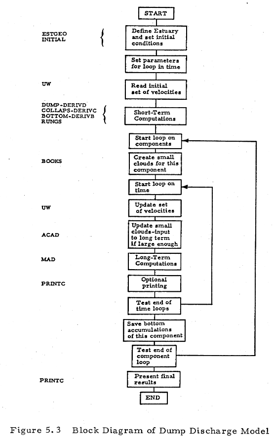
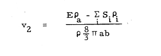
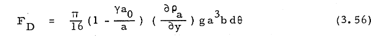
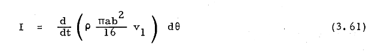

# General Notes

The purpose of this document is to hold general notes about the model and how it works

I'm confused on how the system evolves. Well either way I'm going to need initial conditions so let's focus on that

# Dump Discharge Variables

* NMAX - Maximum dimension of long-term passive diffusion array in z-direction
* MMAX - Maximum dimension of long-term passive diffusion array in x-direction
* NS - Number of solid components in discharge (not greater than 12)
* NVL - Number of velocity levels in discharge (not greater than 1 or 2)
* NSC - Maximum number of small clouds allowed per component for transition from short term to long term (value of 20 suggested)

KEY1 -

    (1) Use default coefficients suggested by Tetra Tech
    (2) Use coefficients suggested by user

KEY2 -

    (1) Computation stops at end of convective descent phase
    (2) Computation stops at end of dynamic collapse
    (3) Computation stops at end  of long-term diffusion

KEY3 -

    (1) long term diffusion for fluid component
    (2) no long term diffusion for fluid component

KEY4 -

    (1) No action
    (2) Subsitute user specified time steps, DT, for descent and collapse. used in event of repeated runs

IGCN -

    (0) No graphs of convective descent
    (1) One line pritner graph of convective descent
    (2) extra graphs of concentrations for convective phase

IGCL -

    (0) No grpahs of dynamic collapse
    (1) one line printer graph

IPCN -

    (0) No printed record of convective descent phase
    (1) on eline printer graph
IPCL -

    (0) No printed record of dynamic collapse phase
    (1) Printed output included

IPLT -

    (0) Print Long term results at default times (1/4, 2/4, 3/4, 4/4 of TSTOP)
    (n) Nuber of values to be read in of times to print long-term results (up to 12)

* ID - Free form alphanumeric description of run
* DX - Space step (in feet) for long term grid
* DEPTH(N,M) Depths (in feet) read row y row left to right, top to bottom
* XBarge - X-coordinate of discharging vessel in estuary
* ZBarge - Z-coordinate of dischargine vessel in estuary
* NROA - Numbr of points (in depth) where ambient density is specified
* Y(I) - Depths (in feet) where density is specified. (The final depth value should be equal the deepest depth in the estuary)

-------------------------------------------------------------------------

* ROA(I) - Density of (gm/cc) of ambient water
* IFORM - Type of ambient velocity formation
* ROAA - eqv. ROA(1) - Ambient density at the surface - units of gm/cc (grams/cubic centimeter?)
* DU1 - Depth (feet) to upper U velocity (x-direction)
* DU2 - Depth (feet) to lower U velocity
* UU1 - Upper U velocity
* UU2 - Lower U Velocity
* DW1 - Depth (feet) to lower W velocity
* DW2 - Depth (feet) to lower W velocity
* WW1 - Upper W velocity (ft/sec)
* WW2 - Lower W velocity (ft/sec)

* TDUMP - Time of dump to nearest DTL seconds after start of tidal cycle
* TSTOP - Duration of nearest DTL seconds of simulation after dump (seconds)
* DTL - Long term time step (seconds) time varying velocities are specified at this interval

----------------------------------------------------------------

* DT1U - User-specified time step for convective descent phse (used for repeated runs)
* DT2U - User specified time step for dynamic collapse (used for repeated runs)
* TPRT(I) - Values of time to print long-term results (integer multiples of DTL in seconds) Number of values equals IPLT?

----------------------------------------------------------------

* RB - Radius of initial hemispherical waste cloud (feet)
* DREL - Depth of centroid of initial cloud at release (feet)

* CU(1) - Initial U velocity in x-direction (Might be updated and not just initial) 
* CV(1) - Initial V velocity in y-direction (Might be updated and not just initial)
* CW(1) - Initial W velocity in z-direction (Might be updated and not just initial)

* ROO - Bulk density of initial cloud
* BVOID - Voids ratio of aggregate solids
* PARAM(K) - Alphameric description of solid
* ROAS(K) - Solid density (gm/cc, dry weight) of particle

* CS(K) - Concentration of these particles in volume ratio
* VFALL(K) - Fall velocity of these particles (ft/sec)
* VOIDS(K) - Voids ratio of these particles

* TRACER - Alphameric description of conservative chemical tracer in initial fluid fraction
* CINIT - Concentration of tracer in initial fluid (mg/liter)
* CBACK - Background concentration of ambient fluid

* DINCR1 - Factor used for estimating time step in convective phase
* DINCR2 - Factor used for estimating time step in dynamic collapse

* ALPHA0 - Entrainment coefficient for turbulent thermal

* BETA - settling coeff
* CM - appararent mass coeff
* CD - drag coefficient for a sphere
* gama - density gradient in the cloud
* cdrag - Form drag coeffient for the quadrant of a collapsing oblate spheriod
* cdfir - Skin friction coefficient for the quadrant of a collapsing oblate spheriod
* cd3 - Drag coefficient for an ellipsoidal wedge
* cd4 - Drag coefficient for a plate
* alphac - Entrainment coefficient for collapse
* Frictn - Friction coefficient between cloud and estuary bottom
* F1 - Modificaiton factor used on computing the resistance of the friction force to the collapse of a quadrant of an oblate spheriod
* alambda - Dissipation factor used in computing horizontal diffusion cofficient by four-thirds law
* akyo - maximum vaslue of vertical diffusion coefficient

## Definitions from the textbook
* NTRIAL - Trial solution number
* DT - Time step in seconds
* IPLUNG - State of the cloud

* NUTRL - 

    (0) - Initial value
    (1) - Inidicates the cloud has encountered neutral buoyancy
    (3) - Indicates that the diffusice spreading of the cloud is greater than the dynamic spreading
    
* ISTEP - Number of time steps in the trial solution
* IBED  -

    (0) - Initial value
    (i) - Any other value stores the time step when the cloud hits the bottom

* ILEAVE - 

    (999) - Initial value of 999
    (i)   - Any other value stores the time step when the cloud rises off the bottom

## Variable definitions from code

* CIV - Initial volume of the cloud
* CIVS -
* C1 - Realative concentration - line 589: C1=(ROO-ROA(1))/ROA(1)

* E1 - ?? Density gradient - line
* FF - ??
* EE1 - ?? Line 594 is the first location
* H - ??
* DIF - Long term diffusion parameter

------------------------------------------------------------------------

## Indexs and lengths

* NROA - Number of ambient density coordinates

Meaning of values in E in DerivD

- E(1) - x Location of the barge.

  - Coordinate system referenced to barge location. I think this is kind of dumb since the location of the barge moves. Would be better to keep track of the velocity and the barge in global coordinates once the initial location is determined.

- E(2) - Vertical location of the clouds centroid

- E(3) - z location of the cloud.

  - Coordinate system referenced to barge location.

- E(4) - Mass of the cloud? Entrainment volume \* ambient density
- E(5) - x-momentum Check this
- E(6) - z-momentum Check this
- E(7) - Rate of z momentum change?? Check this
- E(8) - Initial Buoyancy. Used in VOLUME=(E(4)+E(8))/ROA(1)

  - I don't get what the purpose

- E(9) - Vorticity
- E(10) - Stores the volume of class i of solids material. That goes for the rest of these.
- E(11) -
- E(12) -
- E(13) -
- E(14) -
- E(15) -
- E(16) -
- E(17) -
- E(18) -
- E(19) -
- E(20) -
- E(21) -
- E(22) -

## Code flow chart notes

* For Dump short term computations are completed before moving to long term?
* The cloud is split into smaller clouds ?? at some point. I'm not sure what that point is
    * Nvm this is listed at the BOOKS step. "Create small clouds for this component"

### Questions
* How are the location of the components that settle out tracked? Are they advected after they leave the cloud?
* 

### Process Notes

The different stages of the computation are:
1) Init initial geometry
2) Set initial model coeffs
3) Set initial conditions for physical parameters
4) Read/Set the initial velocities across the domain
    * Velocity conditions
    * 

5) Dump (Convective phase) a cloud of sediment into the estuary
    * Use DERIVD and RUNGE to update the model parameters
    * This step tries to move the cloud to a neutrally buoyant position or until it hits the bottom
    * In the og. version DUMP is allowed to history of the descent **5** times.
        * "A trial solutioin is succesful when the cloud has taken between 100 and 200 time steps to either reach a level of neutral buoyancy or to hit the bottom"
        * Not sure how the number of time steps is incremented. What is used to update the time step? (Might be able to use a larger number of time steps. The limit seems pretty arbitrary. Will need to test this though)
    * **DT** is used as as the time step here
    * List of rectangular domain test cases
      * Homogenous density - In zero velocity field - Flat surface and flat bottom
      * Homogenous density - In non-zero constant velocity field - Flat Surface and flat bottom
      * Homogenous density - In non-zero constant velocity field - Flat Surface and variable
      * Linear density     - In zero velocity field (aim for neutral buoyancy)
      * Linear density     - In non-zero constant velocity field (aim for neutral buoyancy)
      * Variable density   - In non-zero constant velocity field
      * Variable density   - In log velocity field **(Add later)**
      * Variable density   - In user defined velocity field **(Add later)**
    
    * List of variable domain test cases
      * Homogenous density - In non-zero velocity field into a wall of soil 
        * Need to think about how to handle boundary conditions here
        * Velocity field 
          * Field can't be uniform here to obey the no penetration condition
          * Might be able to use circulation in a box or some other simple-ish analytical field that contains boundaries
        * Variable dens
6) COLLAPSE (Section 3.2.2 - Dynamic Collapse in Water Column)
    * Cloud turns elliptical (oblate spheriod)
    * 

### Workflow
The work flow is the following:

* Implement velocity variation across the domain
    * In the og. version there are 3? different methods for the velocity to be set

* Include water elevation changes from the tide

* Implement land heights in the domain
    * At any of the nodes there can be land. 
    * Impacts:
        * Velocity field
        * Density field?
        * Diffusion of material
        * Advection of material
        * Constrains on barge location
        * Other things?  

* Implement collapse procedures and required types. 
* Need to figure out which procedures are repeated across 
  * DUMP: Descent, Collapse, Bottom
  * JET : Descent, Collapse, Bottom
  * Some of the math procedures 
* Need to work with cloud type to make check how things are going to work moving from:
  * DESCENT: a downward facing half-sphere, to an oblate spheriod, to an upward facing half-sphere and possibly back to something else
* Need to be able to split clouds and work with those smaller clouds 

_________________

# Jet discarge params

* TJET - Duration of the jet discharge
* SAI - Course of the barge (assumed constant and measured anti-clockwise from the positive x-axis)
* UB  - Speed of the barge

IPLING -

    (0) Initial value
    (1) jet encountered the bottom in subroutine JET
    (2) Inidicates the collapsing plume encountered the bottom in subrouting COLLAPS
    (4) Indicates the plume encountered the bottom and subsequently rose off the bottom

NUTRL - 
    (0) Initial value
    (1) Indicates the jet path has become horizontal
    (3) Inidcates that the diffusive spreading of the plume is greater than dynamic spreading

* ISTEP - Number of times steps in the trial solution

* IBED - 
    (0) Initial value
    (i) Any other value stores the time step when the jet-plume hit the bottom

* ILEAVE -
    (999) Initial value of 999
    (i) Any other value stores the time step when the jet-plume rises off the bottom

# Sources
1) Development of Models for Prediction of Short-term Fate of dredged Material Discharged in the Estuarine Environment

